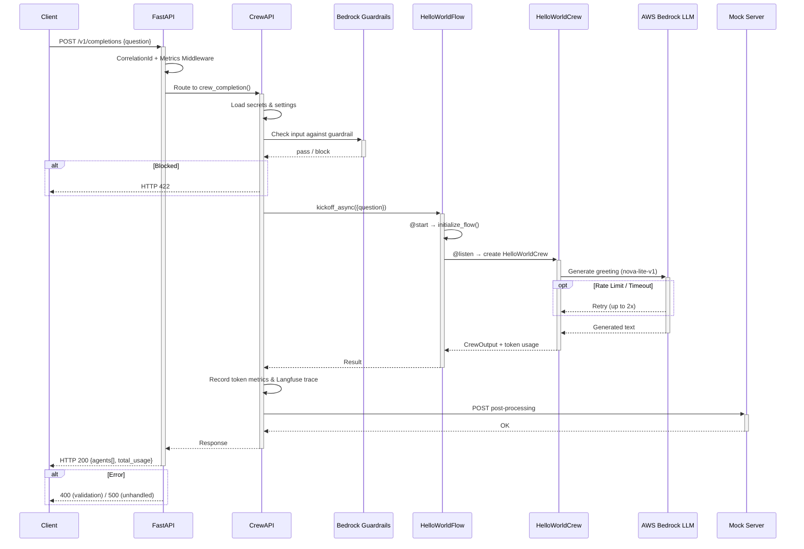

```mermaid
sequenceDiagram
    participant Client
    participant FastAPI
    participant CrewAPI
    participant Guardrails as Bedrock Guardrails
    participant Flow as HelloWorldFlow
    participant Crew as HelloWorldCrew
    participant LLM as AWS Bedrock LLM
    participant MockServer as Mock Server

    Client->>+FastAPI: POST /v1/completions {question}
    FastAPI->>FastAPI: CorrelationId + Metrics Middleware

    FastAPI->>+CrewAPI: Route to crew_completion()
    CrewAPI->>CrewAPI: Load secrets & settings

    CrewAPI->>+Guardrails: Check input against guardrail
    Guardrails-->>-CrewAPI: pass / block

    alt Blocked
        CrewAPI-->>Client: HTTP 422
    end

    CrewAPI->>+Flow: kickoff_async({question})
    Flow->>Flow: @start → initialize_flow()
    Flow->>+Crew: @listen → create HelloWorldCrew
    Crew->>+LLM: Generate greeting (nova-lite-v1)
    opt Rate Limit / Timeout
        LLM-->>Crew: Retry (up to 2x)
    end
    LLM-->>-Crew: Generated text
    Crew-->>-Flow: CrewOutput + token usage
    Flow-->>-CrewAPI: Result

    CrewAPI->>CrewAPI: Record token metrics & Langfuse trace
    CrewAPI->>+MockServer: POST post-processing
    MockServer-->>-CrewAPI: OK

    CrewAPI-->>-FastAPI: Response
    FastAPI-->>-Client: HTTP 200 {agents[], total_usage}

    alt Error
        FastAPI-->>Client: 400 (validation) / 500 (unhandled)
    end
```
