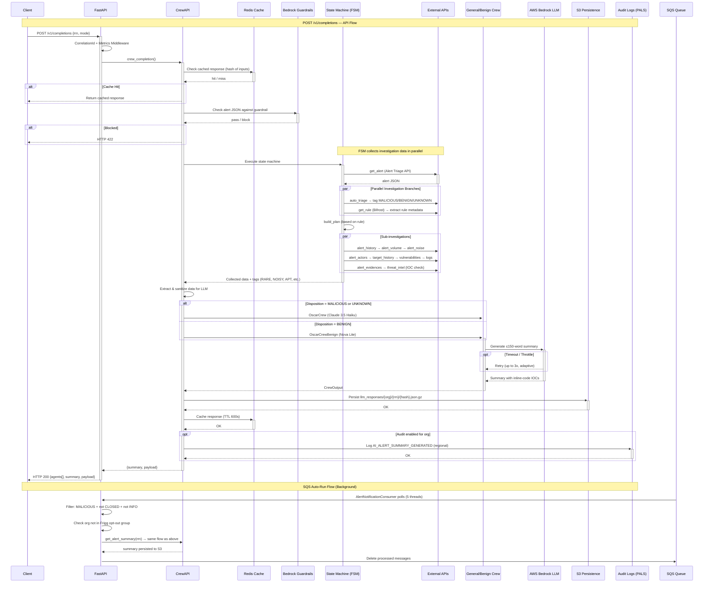

```mermaid
sequenceDiagram
    participant Client
    participant FastAPI
    participant CrewAPI
    participant Cache as Redis Cache
    participant Guardrails as Bedrock Guardrails
    participant FSM as State Machine (FSM)
    participant APIs as External APIs
    participant Crew as General/Benign Crew
    participant LLM as AWS Bedrock LLM
    participant S3 as S3 Persistence
    participant PALS as Audit Logs (PALS)

    Note over Client, PALS: POST /v1/completions — API Flow

    Client->>+FastAPI: POST /v1/completions {rrn, mode}
    FastAPI->>FastAPI: CorrelationId + Metrics Middleware
    FastAPI->>+CrewAPI: crew_completion()

    CrewAPI->>+Cache: Check cached response (hash of inputs)
    Cache-->>-CrewAPI: hit / miss

    alt Cache Hit
        CrewAPI-->>Client: Return cached response
    end

    CrewAPI->>+Guardrails: Check alert JSON against guardrail
    Guardrails-->>-CrewAPI: pass / block
    alt Blocked
        CrewAPI-->>Client: HTTP 422
    end

    Note over FSM, APIs: FSM collects investigation data in parallel

    CrewAPI->>+FSM: Execute state machine
    FSM->>+APIs: get_alert (Alert Triage API)
    APIs-->>-FSM: alert JSON

    par Parallel Investigation Branches
        FSM->>APIs: auto_triage → tag MALICIOUS/BENIGN/UNKNOWN
        FSM->>APIs: get_rule (Bifrost) → extract rule metadata
    end

    FSM->>FSM: build_plan (based on rule)

    par Sub-investigations
        FSM->>APIs: alert_history → alert_volume → alert_noise
        FSM->>APIs: alert_actors → target_history → vulnerabilities → logs
        FSM->>APIs: alert_evidences → threat_intel (IOC check)
    end

    FSM-->>-CrewAPI: Collected data + tags (RARE, NOISY, APT, etc.)

    CrewAPI->>CrewAPI: Extract & sanitize data for LLM

    alt Disposition = MALICIOUS or UNKNOWN
        CrewAPI->>+Crew: OscarCrew (Claude 3.5 Haiku)
    else Disposition = BENIGN
        CrewAPI->>+Crew: OscarCrewBenign (Nova Lite)
    end

    Crew->>+LLM: Generate ≤150-word summary
    opt Timeout / Throttle
        LLM-->>Crew: Retry (up to 3x, adaptive)
    end
    LLM-->>-Crew: Summary with inline-code IOCs
    Crew-->>-CrewAPI: CrewOutput

    CrewAPI->>+S3: Persist llm_responses/{org}/{rrn}/{hash}.json.gz
    S3-->>-CrewAPI: OK

    CrewAPI->>+Cache: Cache response (TTL 600s)
    Cache-->>-CrewAPI: OK

    opt Audit enabled for org
        CrewAPI->>+PALS: Log AI_ALERT_SUMMARY_GENERATED (regional)
        PALS-->>-CrewAPI: OK
    end

    CrewAPI-->>-FastAPI: {summary, payload}
    FastAPI-->>-Client: HTTP 200 {agents[], summary, payload}

    Note over Client, PALS: SQS Auto-Run Flow (Background)

    participant SQS as SQS Queue

    SQS->>+FastAPI: AlertNotificationConsumer polls (5 threads)
    FastAPI->>FastAPI: Filter: MALICIOUS + not CLOSED + not INFO
    FastAPI->>FastAPI: Check org not in Frigg opt-out group
    FastAPI->>CrewAPI: get_alert_summary(rrn) → same flow as above
    CrewAPI-->>FastAPI: summary persisted to S3
    FastAPI->>SQS: Delete processed messages
```
